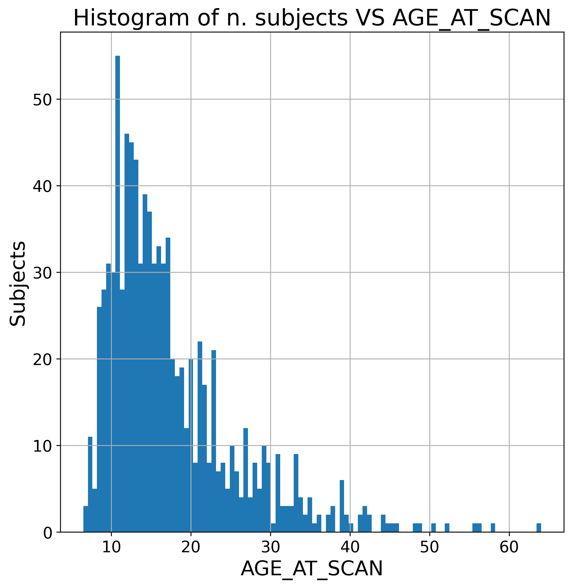

[](https://brain-age-predictor.readthedocs.io/en/latest/?badge=latest)
[](https://github.com/lorenzomarini96/microcal_classifier/blob/main/LICENSE)

## brain_age_predictor

This repository contains a project for Computing Methods for Experimental Physics and Data Analysis course.

The aim is to design and implement a regression model to predict the age of the healthy subjects from brain data features extracted from T1-weighted MRI images. Datas are taken from to the well known [ABIDE] (http://fcon_1000.projects.nitrc.org/indi/abide/abide_I.html) dataset, in which are present subjects affected by Autism Spectre Disorder (ASD) and healthy control subjects (CTR).

The algorithm allows to:
-visualize and explore ABIDE datas;
-make data harmonization by site;
-train different regression models using different cross validation;
-confront two alternative approaches to the problem.

The repository is structured as follows:
```
brain_age_predictor/
├── docs
├── LICENSE
├── dataset/
├── brain_age_predictor/
│   ├── images/
│   ├── metrics/
│   ├── best_estimator/
│   ├── preprocess.py
│   ├── brain_age_pred.py
│   ├── brain_age_site.py
│   ├── grid_CV.py
│   ├── loso_CV.py
│   ├── __init__.py
│   ├── variability.py
│   ├── DDNregressor.py
│   ├── predict_helper.py
│   └── wavelethelper.py
├── README.md
├── requirements.txt
└── tests
    └── test.py
    └── __init__.py
```
Results' plots are collected in 'images' folder, while fitted models and relative metrics' results are stored respectively in 'best_estimator' and 'metrics' folders.
##Data

Datas from ABIDE (Autism Brain Imaging Data Exchange) are contained in .csv files inside brain_age_predictor/dataset folder and are handled with Pandas. This dataset contains 419 brain morphological features (volumes, thickness, area, etc.) of different brain segmented area (via Freesurfer sofware) belonging to 915 male subjects (451 cases, 464 controls) pespectively with with total mean age of 
17.47 ± 0.36 and 17.38 ± 0.40. 
The age distribution of subjects, although heterogeneous between CTR and ASD groups, presents quite a skewed profile:

while also age distribution across sites change quite drastically as shown in the following boxplot:


## Site harmonization

On top of these differencies, another import confounding factor is related to the effect of the different acquisition sites on the features. To mitigate this effect, the state-of-art harmonization tool [neuroHarmonize](https://github.com/rpomponio/neuroHarmonize) implemented by [Pomponio et al.](https://www.sciencedirect.com/science/article/pii/S1053811919310419?via%3Dihub) has been used.


neuroHarmonize corrects differences introducted by multi-site image acquisition preserving specified covariates. So, harmonization can be safely performed without affecting age-related biological variability of the dataset.
This is particulary important as different sites have different age distribution.
The analysis has been conducted using 'unharmonized' and 'harmonized' datas.

##Models and Cross Validation
Different models have been evaluated on age prediction performances by means of typical regression metrics (MAE, MSE); specifically, 
